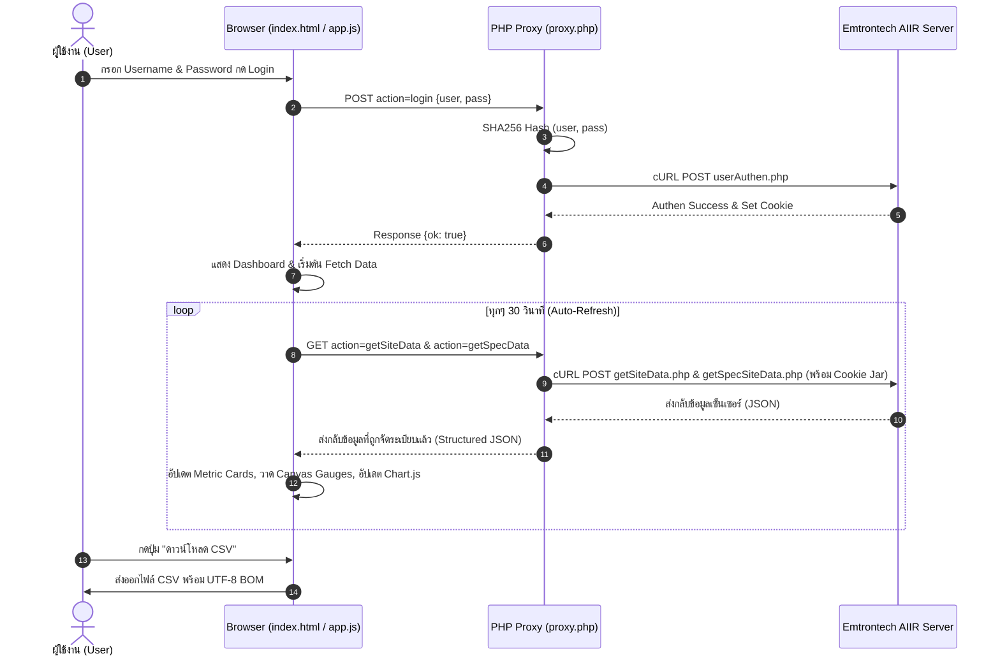

# 📘 รายงานอธิบายโค้ดทั้งหมดของโปรเจกต์ (Comprehensive Code Explanation)
**โปรเจกต์**: AIIR IAQ Smart Dashboard (ICT BRB)  
**จัดทำเมื่อ**: 3 สิงหาคม 2026  

---

## 📑 สารบัญ (Table of Contents)
1. [ภาพรวมของระบบ (System Overview)](#1-ภาพรวมของระบบ-system-overview)
2. [โครงสร้างไฟล์ (Project File Structure)](#2-โครงสร้างไฟล์-project-file-structure)
3. [อธิบายโค้ดอย่างละเอียดทีละไฟล์ (Detailed File Explanations)](#3-อธิบายโค้ดอย่างละเอียดทีละไฟล์-detailed-file-explanations)
   - [3.1 index.html (ส่วนแสดงผลโครงสร้างเว็บ UI)](#31-indexhtml-ส่วนแสดงผลโครงสร้างเว็บ-ui)
   - [3.2 proxy.php (ส่วน Backend API Proxy & Authentication)](#32-proxyphp-ส่วน-backend-api-proxy--authentication)
   - [3.3 js/app.js (ส่วน Business Logic, Fetching & Charts)](#33-jsappjs-ส่วน-business-logic-fetching--charts)
   - [3.4 css/style.css (ส่วนการจัดสไตล์, ดีไซน์ธีม & Animations)](#34-cssstylecss-ส่วนการจัดสไตล์-ดีไซน์ธีม--animations)
4. [สรุปวงจรการทำงานและการไหลของข้อมูล (Data Flow Architecture)](#4-สรุปวงจรการทำงานและการไหลของข้อมูล-data-flow-architecture)

---

## 1. ภาพรวมของระบบ (System Overview)

โปรเจกต์ **AIIR IAQ Smart Dashboard (ICT BRB)** เป็นระบบเว็บแอปพลิเคชันสำหรับติดตามและมอนิเตอร์คุณภาพอากาศภายในอาคาร (Indoor Air Quality - IAQ) แบบ Real-time โดยดึงข้อมูลจากเซ็นเซอร์ผ่าน **Emtrontech AIIR API Server**

### สถาปัตยกรรมระบบ (Architecture Overview):
```text
[ Browser Client ] ──(AJAX / JSON)──> [ PHP Proxy (proxy.php) ] ──(cURL Session)──> [ AIIR API Server ]
  index.html &                            - Login / SHA256                               emtrontech.com
  js/app.js                               - Cookie Jar Management
                                          - CORS Handling & Data Parsing
```

---

## 2. โครงสร้างไฟล์ (Project File Structure)

```text
c:\Users\tn_setthanan\Desktop\Copy\
├── index.html        # โครงสร้าง HTML5 Semantic หน้าแดชบอร์ด
├── proxy.php         # PHP Proxy จัดการ Authen, Session Cookie และ Route API Request
├── css/
│   └── style.css     # CSS Custom Properties, Design System Palette, Themes & Animations
├── js/
│   └── app.js        # Business Logic, Data Processing, Canvas Gauges, Chart.js & CSV Export
├── README.md         # เอกสารแนะนำโปรเจกต์และการใช้งาน
└── CODE_EXPLANATION.md # [ไฟล์นี้] อธิบายโค้ดโดยละเอียดทุกไฟล์
```

---

## 3. อธิบายโค้ดอย่างละเอียดทีละไฟล์ (Detailed File Explanations)

---

### 3.1 `index.html` (ส่วนแสดงผลโครงสร้างเว็บ UI)

[index.html](file:///c:/Users/tn_setthanan/Desktop/Copy/index.html) เป็นไฟล์โครงสร้างเว็บ (HTML5 Semantic) สำหรับจัดวาง Layout และ Element ทั้งหมดของ Dashboard

#### โครงสร้างหลักภายในไฟล์:
1. **`<head>` (บรรทัด 1–14)**:
   - นำเข้า Font **Inter** จาก Google Fonts
   - นำเข้าไลบรารี **Chart.js v4.4.3** จาก CDN สำหรับแสดงกราฟเส้นแนวโน้ม
   - เชื่อมต่อกับไฟล์สไตล์ [`css/style.css`](file:///c:/Users/tn_setthanan/Desktop/Copy/css/style.css)

2. **`<aside class="sidebar" id="sidebar">` (บรรทัด 18–65)**:
   - **Header & Logo**: แสดงโลโก้ 🌿 และชื่อแบรนด์ AIIR Dashboard
   - **Status Badge (`#statusBadge`)**: แสดงสถานะการเชื่อมต่อ (Connected / Disconnected)
   - **Login Form (`#loginForm`)**: ฟอร์มกรอก Username/Password (จะถูกซ่อนอัตโนมัติเมื่อเข้าสู่ระบบสำเร็จ)
   - **User Session Card (`#userSessionCard`)**: การ์ดแสดงชื่อผู้ใช้ที่กำลังเข้าสู่ระบบและปุ่ม Logout (แสดงผลเฉพาะเมื่อเข้าสู่ระบบสำเร็จ)
   - **Auto-Refresh Toggle (`#autoRefreshToggle`)**: สวิตช์เปิด/ปิดการดึงข้อมูลใหม่อัตโนมัติทุก 30 วินาที
   - **Last Update (`#lastUpdateWrap`)**: แสดงเวลาอัปเดตข้อมูลล่าสุดจากเซ็นเซอร์

3. **`<main class="main-content" id="mainContent">`**:
   - **Topbar (`.topbar`)**: แถบด้านบนแบบตรึง มีปุ่มสลับการพับ/กาง Sidebar (`#sidebarToggleBtn`) และส่วนแสดงชื่อบัญชีผู้ใช้มุมขวาบน (`#topbarUserArea`) พร้อมปุ่ม Logout
   - **Welcome Screen (`#welcomeScreen`)**: หน้าจอต้อนรับ แสดงเมื่อผู้ใช้ยังไม่ได้ Login
   - **Dashboard Container (`#dashboard`)**: หน้าจอแสดงผลหลัก (เปิดใช้งานและซ่อนหน้า Login เมื่อ Login สำเร็จ):
      - **Room Panel: SITE 4 ICT 401 (`#panel-site4`)**:
        - **Hero Gauge Cards (3 ตัววัดหลัก)**: รวมเกจครึ่งวงกลมและตัวเลขของ PM2.5, CO2, และ อุณหภูมิ ไว้ในการ์ดใบเดียวกันเพื่อความสมส่วน
        - **Environmental Telemetry Grid (4 ตัววัดสภาพแวดล้อม)**: PM10, ความชื้น, EVOC และ RSSI Signal จัดวางใน 4 คอลัมน์กะทัดรัด
        - **Control Recommendations**: การ์ดแสดงคำแนะนำการทำงานอุปกรณ์อัตโนมัติ (Air Purifier, Ventilation, AC, Humidity Control)
        - **Historical Trend Chart**: Canvas สำหรับกราฟเส้นแนวโน้ม 10 ครั้งล่าสุด (`#trendChart`)
   - **Toast Notification (`#toast`)**: กรอบแจ้งเตือนข้อความสถานะมุมล่าง

---

### 3.2 `proxy.php` (ส่วน Backend API Proxy & Authentication)

[proxy.php](file:///c:/Users/tn_setthanan/Desktop/Copy/proxy.php) ทำหน้าที่เป็นตัวกลาง (Middleware/Proxy) ระหว่างหน้าเว็บเบราว์เซอร์กับ **Emtrontech AIIR API Server** เพื่อแก้ปัญหา CORS, จัดการ Session Cookie Jar, รวมถึงระบบ **Server-Side Cache (5s TTL)** และ **Anti-DoS Rate Limiter** ป้องกันการยิงสแปม API

#### โครงสร้างและการทำงานภายในไฟล์:
1. **Anti-DoS Rate Limiter (`checkRateLimit()`)**:
   - จำกัดจำนวนคำขอต่อ IP แอดเดรสสูงสุด **60 ครั้งต่อนาที** (`RATE_LIMIT_MAX = 60`)
   - หากยิงคำขอถี่เกินเกณฑ์ ระบบจะตอบกลับด้วย **HTTP Status 429 Too Many Requests** ป้องกันการโจมตีเว็บ (Denial of Service)

2. **Server-Side Cache System (`getFromCache()`, `saveToCache()`)**:
   - บันทึกผลลัพธ์ข้อมูลจาก API ลงไฟล์แคชชั่วคราว มีอายุ **5 วินาที** (`CACHE_TTL = 5`)
   - **ข้อดี**: แม้มีผู้ใช้รีเฟรชหน้าจอ 100 ครั้งภายใน 5 วินาที ระบบจะยิง cURL ออกไปหาเซิร์ฟเวอร์หลักเพียง **1 ครั้งเท่านั้น** ส่วนที่เหลือจะตอบกลับจากแคชทันที (ความเร็วตอบกลับ ~1ms) ป้องกันการโดนแบน IP จากเซิร์ฟเวอร์หลัก

3. **Server-Side File History Store (`saveHistoryRecord()`, `getHistoryRecords()`)**:
   - บันทึกประวัติข้อมูลเซ็นเซอร์ย้อนหลังลงในไฟล์ JSON ชั่วคราวบนเซิร์ฟเวอร์ (`/tmp/aiir_history_ict401.json`)
   - **ข้อดี**: ไม่ต้องพึ่งพาฐานข้อมูลหนัก (เช่น MySQL/MongoDB) แต่คงเก็บข้อมูลย้อนหลังได้สูงสุด **2,000 จุด (~16 ชั่วโมง)** โดยใช้ระบบ Sliding Window ป้องกันไม่ให้ไฟล์มีขนาดใหญ่เกินไป
   - เมื่อกด F5 หรือเปิดหน้าเว็บจากอุปกรณ์อื่น กราฟเส้นแนวโน้มย้อนหลังจะโหลดข้อมูลที่เซิร์ฟเวอร์สะสมไว้ออกมาแสดงผลได้ทันที

4. **Action Router & Helper Functions (`makeCurl()`, `doLogin()`, `checkSession()`, `getSpecData()`, `getHistory()`, `doLogout()`)**:
   - `checkSession()`: ตรวจสอบสถานะการเข้าสู่ระบบในเซสชัน PHP และส่งกลับสถานะ `loggedIn` พร้อมชื่อบัญชีผู้ใช้เมื่อมีการรีเฟรชหน้าจอ (F5)
   - `getSpecData()`: ดึงข้อมูลเฉพาะห้อง SITE 4 ICT 401 แนบอาร์เรย์ประวัติ `history` จากไฟล์แคชเซิร์ฟเวอร์ส่งกลับไปยังเบราว์เซอร์
   - `clearAllCache()`: ล้างแคชคำตอบทั้งหมดทันทีที่มีการ Login ใหม่ หรือ Logout ออกจากระบบ

---

### 3.3 `js/app.js` (ส่วน Business Logic, Fetching & Charts)

[js/app.js](file:///c:/Users/tn_setthanan/Desktop/Copy/js/app.js) เป็นส่วนหัวใจสำคัญที่ควบคุมการทำงานฝั่ง Front-end ทั้งหมด

#### โครงสร้างและการทำงานภายในไฟล์:
1. **Config & State Objects (บรรทัด 9–31)**:
   - `CONFIG`: กำหนด URL ปลายทาง `proxy.php?action=getSpecData&site=4&siteType=4` สำหรับดึงข้อมูลห้อง ICT401 โดยเฉพาะ, รอบ Auto-Refresh (30,000 ms), จำนวนจุดย้อนหลังบนกราฟแนวโน้ม (10 จุด)
   - `STATE`: เก็บสถานะแอปพลิเคชัน เช่น `isLoggedIn`, `site4Data`, `historyLogs`, อาร์เรย์เก็บประวัติสำหรับกราฟเส้น, ตัวแปรเก็บ Chart Instance

2. **UI Controls & Theme (บรรทัด 52–112)**:
   - `toggleSidebar()`, `toggleSidebarCollapse()`: เปิด/ปิด หรือซ่อนแถบ Sidebar (รวมถึงปรับขนาด Canvas เกจหลังจากพับเมนู)
   - `toggleTheme()`, `applyTheme()`, `initTheme()`: สลับและบันทึกธีม Light/Dark Mode ลงใน `localStorage`

3. **Authentication Handlers (บรรทัด 166–240)**:
   - `handleLogin(e)`: รับการ Submit ฟอร์ม Login แสดง Spinner โหลด ยิง API ไปยัง `proxy.php?action=login`
   - `setConnected(on)`: ปรับ UI สถานะ Badge ด้านซ้าย (Online/Offline) และเปิด/ซ่อนหน้า Dashboard

4. **Data Fetching Engine (บรรทัด 242–335)**:
   - `fetchData()`: ดึงข้อมูลเฉพาะ **ห้อง SITE 4 ICT 401** จาก `CONFIG.specDataUrl`
   - `realFetchSite4()`: รับ JSON จาก `proxy.php` ตรวจสอบ Session Expired (ถ้า Session หมดอายุจะแจ้งเตือนและปรับสถานะเป็น Disconnected)
   - `startAutoRefresh()` / `stopAutoRefresh()`: จัดการ `setInterval` ตามสวิตช์ Auto-Refresh

5. **Data Rendering**:
   - `appendHistory(data)`: เพิ่มข้อมูลล่าสุดเข้าอาร์เรย์ประวัติ (จำกัดไว้ไม่เกิน 10 จุดล่าสุด) และบันทึกประวัติลงใน `historyLogs`
   - `renderSiteDetail(data)`: อัปเดตการ์ดตัววัดทั้ง 7 ตัวของ Site 4 (คำนวณเปอร์เซ็นต์หลอด Progress Bar และเปลี่ยนสีตามระดับความอันตราย)
   - `downloadCSV()`: ส่งออกไฟล์ CSV ประวัติข้อมูลย้อนหลังของห้อง ICT401

6. **Control Recommendations Logic (บรรทัด 560–586)**:
6. **AI Smart HVAC Automation Engine (บรรทัด 520–635)**:
   - `runAIInferenceEngine(pm25, pm10, co2, temp, humid, evoc)`: ประมวลผลด้วย AI Inference Model จำลองแบบ Multi-Variable Joint Decision Matrix:
     - **AI IAQ Score (0-100%)**: คำนวณคะแนนดัชนีสุขภาพอากาศรวมจาก PM2.5, PM10, CO2, EVOC, อุณหภูมิและความชื้น
     - **Steadman Heat Index Model**: คำนวณอุณหภูมิที่รู้สึกจริง (Perceived Temperature) ตามความชื้นสัมพัทธ์
     - **Air Purifier AI**: ประเมิน HEPA + Carbon Filter Boost (High 85-100% / Eco Auto 45% / Standby 15%)
     - **Ventilation AI**: คำนวณอัตราแลกเปลี่ยนอากาศ (Air Exchange Rate 3.8 ACH / Fresh Air Valve %)
     - **Air Conditioner AI**: ประเมินสภาวะสบายทางความร้อน (PMV Index) ปรับ Cool High / Cool Auto / Eco Saving
     - **Humidity Control AI**: คำนวณโหมดดึงความชื้น (Dehumidifier High/Low) ป้องกันไวรัสและเชื้อรา หรือเติมความชื้น (Humidifier)
     - **AI Reasoning Banner**: สร้างคำอธิบายแผนการทำงานของ AI ในภาษาธรรมชาติ (Natural Language AI Insight)

7. **Semi-Circle Gauges Rendering (บรรทัด 588–693)**:
   - `drawGauge(canvasId, value, max, ranges, label, unit)`: ใช้อัลกอริทึม HTML5 Canvas 2D Context วาดเกจทรงโค้งครึ่งวงกลม
   - รองรับ High-DPI Display (`devicePixelRatio`) การวาดส่วนโค้ง Background, Arc เติมค่าสีแบบ Dynamic Shadow และพิมพ์ตัวเลขพร้อม Label

8. **Historical Trend Line Chart (บรรทัด 703–804)**:
   - `updateTrendChart()`: ใช้ **Chart.js** วาดกราฟเส้นแสดงแนวโน้มย้อนหลัง 10 ครั้งล่าสุด 3 เส้นประกอบด้วย:
     - `PM2.5` (สี Teal `#0D9488`)
     - `CO2 ÷ 10` (สี Azure `#0284C7`)
     - `Temperature` (สี Terracotta `#C36D4B`)
   - รองรับการอัปเดตสีและข้อความอัตโนมัติเมื่อผู้ใช้เปลี่ยนธีม Light/Dark

9. **CSV Export (บรรทัด 806–824)**:
   - `downloadCSV()`: แปลงข้อมูล `STATE.allSitesData` เป็นรูปแบบ CSV สเกลตาม RFC 4180
   - ใส่ **UTF-8 BOM** (`\uFEFF`) นำหน้าเพื่อให้เปิดอ่านภาษาไทยบน Microsoft Excel ได้ถูกต้อง ไม่เป็นภาษาต่างดาว

---

### 3.4 `css/style.css` (ส่วนการจัดสไตล์, ดีไซน์ธีม & Animations)

[css/style.css](file:///c:/Users/tn_setthanan/Desktop/Copy/css/style.css) จัดการรูปแบบความสวยงาม โครงสร้าง Grid/Flexbox ธีมสี และ Effect การเคลื่อนไหว

#### โครงสร้างหลักภายในไฟล์:
1. **Design System & CSS Variables (บรรทัด 7–80)**:
   - **Light Mode Palette (`:root`, `:root[data-theme="light"]`)**:
     - Primary: Teal `#0D9488`
     - Secondary: Azure `#0284C7`
     - Tertiary: Terracotta `#C36D4B`
     - Neutral: Slate `#737877`
     - พื้นหลังหลัก: `linear-gradient(135deg, #F8FAFC 0%, #F1F5F9 50%, #E2E8F0 100%)`
   - **Dark Mode Palette (`:root[data-theme="dark"]`)**:
     - ปรับพื้นหลังและการ์ดกระจก Glassmorphism เป็นโทนเข้ม มืด สบายตา (`rgba(20, 40, 37, 0.75)`)

2. **Sidebar & Responsive Navigation (บรรทัด 99–199)**:
   - สไตล์เมนูด้านข้าง กราฟิกการย่อ/กาง Sidebar (`body.sidebar-collapsed`)
   - ปรับสถานะจุดไฟกะพริบ Connection Dot Pulse Animation (`@keyframes dotPulse`)

3. **Glassmorphism Panels & Metric Cards (บรรทัด 280–480)**:
   - การ์ดกระจกใส (`.glass-panel`) ตกแต่งด้วย `backdrop-filter: blur(...)` พร้อมเงาละมุน
   - การ์ดแสดงผลตัววัด 7 ชนิด ตกแต่งหลอด Progress Bar แบบลื่นไหลด้วย CSS Transition

4. **Animations & Responsive Breakpoints (บรรทัด 750–914)**:
   - `@keyframes floatLogo`: Animation โลโก้ลอยขึ้นลงนุ่มนวล
   - `@keyframes spin`: Animation หมุนปุ่ม Refresh
   - Media Queries (`@media (max-width: 1024px)`, `@media (max-width: 768px)`): รองรับการแสดงผลทุกขนาดหน้าจอ เช่น มือถือ แท็บเล็ต และคอมพิวเตอร์

---

## 4. สรุปวงจรการทำงานและการไหลของข้อมูล (Data Flow Architecture)



---
*เอกสารนี้ถูกสร้างขึ้นเพื่ออธิบายรายละเอียดการทำงานของโค้ดโปรเจกต์ AIIR IAQ Smart Dashboard ทั้งหมดอย่างสมบูรณ์* 🌿
