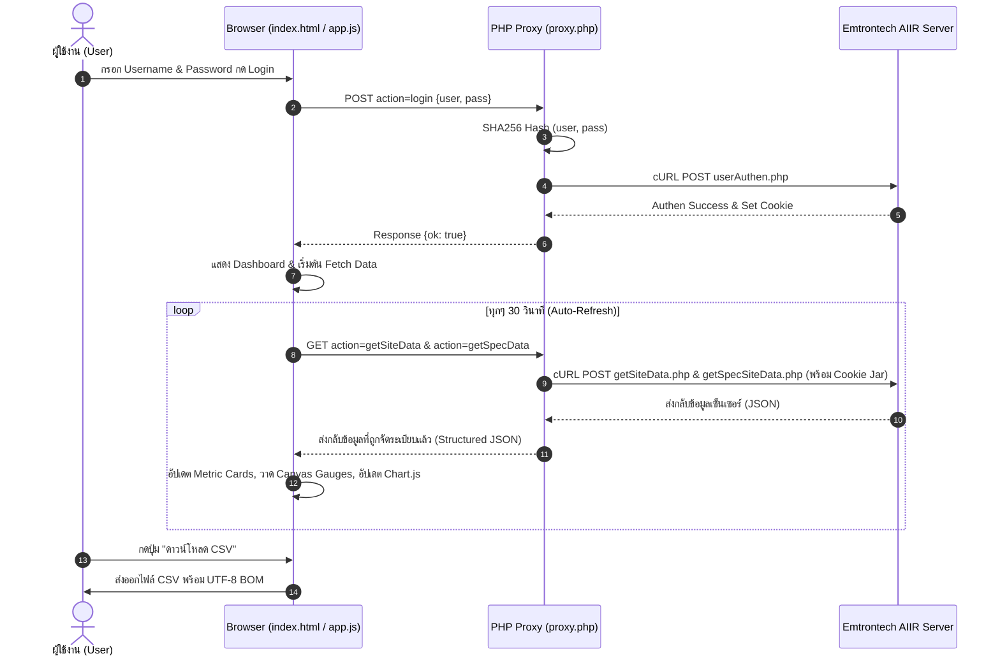

# 📘 รายงานอธิบายโค้ดทั้งหมดของโปรเจกต์ (Comprehensive Code Explanation)
**โปรเจกต์**: AIIR IAQ Smart Dashboard (ICT BRB)  
**จัดทำเมื่อ**: 3 สิงหาคม 2026  

---

## 📑 สารบัญ (Table of Contents)
1. [ภาพรวมของระบบ (System Overview)](#1-ภาพรวมของระบบ-system-overview)
2. [โครงสร้างไฟล์ (Project File Structure)](#2-โครงสร้างไฟล์-project-file-structure)
3. [อธิบายโค้ดอย่างละเอียดทีละไฟล์ (Detailed File Explanations)](#3-อธิบายโค้ดอย่างละเอียดทีละไฟล์-detailed-file-explanations)
   - [3.1 index.html (ส่วนแสดงผลโครงสร้างเว็บ UI)](#31-indexhtml-ส่วนแสดงผลโครงสร้างเว็บ-ui)
   - [3.2 proxy.php (ส่วน Backend API Proxy & Authentication)](#32-proxyphp-ส่วน-backend-api-proxy--authentication)
   - [3.3 js/app.js (ส่วน Business Logic, Fetching & Charts)](#33-jsappjs-ส่วน-business-logic-fetching--charts)
   - [3.4 css/style.css (ส่วนการจัดสไตล์, ดีไซน์ธีม & Animations)](#34-cssstylecss-ส่วนการจัดสไตล์-ดีไซน์ธีม--animations)
4. [สรุปวงจรการทำงานและการไหลของข้อมูล (Data Flow Architecture)](#4-สรุปวงจรการทำงานและการไหลของข้อมูล-data-flow-architecture)

---

## 1. ภาพรวมของระบบ (System Overview)

โปรเจกต์ **AIIR IAQ Smart Dashboard (ICT BRB)** เป็นระบบเว็บแอปพลิเคชันสำหรับติดตามและมอนิเตอร์คุณภาพอากาศภายในอาคาร (Indoor Air Quality - IAQ) แบบ Real-time โดยดึงข้อมูลจากเซ็นเซอร์ผ่าน **Emtrontech AIIR API Server**

### สถาปัตยกรรมระบบ (Architecture Overview):
```text
[ Browser Client ] ──(AJAX / JSON)──> [ PHP Proxy (proxy.php) ] ──(cURL Session)──> [ AIIR API Server ]
  index.html &                            - Login / SHA256                               emtrontech.com
  js/app.js                               - Cookie Jar Management
                                          - CORS Handling & Data Parsing
```

---

## 2. โครงสร้างไฟล์ (Project File Structure)

```text
c:\Users\tn_setthanan\Desktop\Copy\
├── index.html        # โครงสร้าง HTML5 Semantic หน้าแดชบอร์ด
├── proxy.php         # PHP Proxy จัดการ Authen, Session Cookie และ Route API Request
├── css/
│   └── style.css     # CSS Custom Properties, Design System Palette, Themes & Animations
├── js/
│   └── app.js        # Business Logic, Data Processing, Canvas Gauges, Chart.js & CSV Export
├── README.md         # เอกสารแนะนำโปรเจกต์และการใช้งาน
└── CODE_EXPLANATION.md # [ไฟล์นี้] อธิบายโค้ดโดยละเอียดทุกไฟล์
```

---

## 3. อธิบายโค้ดอย่างละเอียดทีละไฟล์ (Detailed File Explanations)

---

### 3.1 `index.html` (ส่วนแสดงผลโครงสร้างเว็บ UI)

[index.html](file:///c:/Users/tn_setthanan/Desktop/Copy/index.html) เป็นไฟล์โครงสร้างเว็บ (HTML5 Semantic) สำหรับจัดวาง Layout และ Element ทั้งหมดของ Dashboard

#### โครงสร้างหลักภายในไฟล์:
1. **`<head>` (บรรทัด 1–14)**:
   - นำเข้า Font **Inter** จาก Google Fonts
   - นำเข้าไลบรารี **Chart.js v4.4.3** จาก CDN สำหรับแสดงกราฟเส้นแนวโน้ม
   - เชื่อมต่อกับไฟล์สไตล์ [`css/style.css`](file:///c:/Users/tn_setthanan/Desktop/Copy/css/style.css)

2. **`<aside class="sidebar" id="sidebar">` (บรรทัด 18–65)**:
   - **Header & Logo**: แสดงโลโก้ 🌿 และชื่อแบรนด์ AIIR Dashboard
   - **Status Badge (`#statusBadge`)**: แสดงสถานะการเชื่อมต่อ (Connected / Disconnected)
   - **Login Form (`#loginForm`)**: ฟอร์มกรอก Username/Password พร้อมปุ่มแสดง/ซ่อน Password และปุ่มกด Login
   - **Auto-Refresh Toggle (`#autoRefreshToggle`)**: สวิตช์เปิด/ปิดการดึงข้อมูลใหม่อัตโนมัติทุก 30 วินาที
   - **Last Update (`#lastUpdateWrap`)**: แสดงเวลาอัปเดตข้อมูลล่าสุดจากเซ็นเซอร์

3. **`<main class="main-content" id="mainContent">` (บรรทัด 71–279)**:
   - **Topbar (`.topbar`)**: แถบด้านบนแบบตรึง มีปุ่มสลับการพับ/กาง Sidebar (`#sidebarToggleBtn`) และปุ่มสลับธีม สว่าง/มืด (`#themeToggleBtn`)
   - **Welcome Screen (`#welcomeScreen`)**: หน้าจอต้อนรับ แสดงเมื่อผู้ใช้ยังไม่ได้ Login
   - **Dashboard Container (`#dashboard`)**: หน้าจอแสดงผลหลัก (จะถูกเปิดใช้งานเมื่อ Login สำเร็จ):
     - **Hero Header**: แสดงปุ่มกด Refresh ข้อมูลด้วยตัวเอง (`#manualRefreshBtn`)
     - **Tab System**:
       - **Tab 1: ภาพรวมทุกจุด (`#panel-overview`)**: แสดง Sites Cards Grid (`#sitesGrid`) และ Data Table (`#sitesTable`) พร้อมปุ่มดาวน์โหลด CSV
       - **Tab 2: ห้อง ICT401 Site 4 (`#panel-site4`)**:
         - **Metric Cards (7 ตัววัด)**: PM2.5, PM10, CO2, อุณหภูมิ, ความชื้น, EVOC (สารระเหยง่าย) และ RSSI (ความแรงสัญญาณ)
         - **Gauge Charts**: Canvas 3 ตัวสำหรับเกจครึ่งวงกลม (PM2.5, CO2, Temperature)
         - **Control Recommendations**: การ์ดแสดงคำแนะนำการทำงานอุปกรณ์อัตโนมัติ (Air Purifier, Ventilation, AC, Humidity Control)
         - **Historical Trend Chart**: Canvas สำหรับกราฟเส้นแนวโน้ม 10 ครั้งล่าสุด (`#trendChart`)
   - **Toast Notification (`#toast`)**: กรอบแจ้งเตือนข้อความสถานะมุมล่าง

---

### 3.2 `proxy.php` (ส่วน Backend API Proxy & Authentication)

[proxy.php](file:///c:/Users/tn_setthanan/Desktop/Copy/proxy.php) ทำหน้าที่เป็นตัวกลาง (Middleware/Proxy) ระหว่างหน้าเว็บเบราว์เซอร์กับ **Emtrontech AIIR API Server** เพื่อแก้ปัญหา CORS และจัดการ Session Cookie Jar

#### โครงสร้างและการทำงานภายในไฟล์:
1. **CORS & Headers (บรรทัด 10–19)**:
   - กำหนด Header ให้ตอบกลับเป็น JSON (`Content-Type: application/json`)
   - อนุญาต Access Control Origin (`*`) และจัดการ Pre-flight `OPTIONS` request

2. **Session Cookie Jar Setup (บรรทัด 21–25)**:
   - เรียก `session_start()` และกำหนดพาธเก็บไฟล์ Cookie Jar ที่ `/tmp/aiir_cookie_[session_id].txt` เพื่อใช้แชร์ Cookie ของเซสชัน cURL

3. **Action Router (บรรทัด 30–41)**:
   - ตรวจสอบพารามิเตอร์ `action` จาก `GET` หรือ `POST` แล้วสวิตช์ฟังก์ชัน:
     - `login` ➔ เรียกฟังก์ชัน `doLogin()`
     - `getSiteData` ➔ เรียกฟังก์ชัน `getSiteData()`
     - `getSpecData` ➔ เรียกฟังก์ชัน `getSpecData()`
     - `logout` ➔ เรียกฟังก์ชัน `doLogout()`

4. **`makeCurl()` Helper Function (บรรทัด 43–91)**:
   - ฟังก์ชันหลักในการยิง HTTP Request ผ่าน cURL
   - รองรับการบันทึกและส่ง Cookie ผ่าน `CURLOPT_COOKIEJAR` และ `CURLOPT_COOKIEFILE`
   - จัดการ User-Agent, Referer, Bypass SSL Verification (`CURLOPT_SSL_VERIFYPEER => false`)

5. **`doLogin()` (บรรทัด 93–128)**:
   - รับค่า `user` และ `pass` แปลงเป็น **SHA256 Hash** (`hash('sha256', ...)`)
   - ส่ง POST ไปยัง `https://emtrontech.com/AIIR/userAuthen.php` ด้วย payload `u={userHash}&p={passHash}&d=0`
   - ทำการยิง GET ตรวจสอบหน้า `index.php` หากไม่โดน Redirect กลับไป `login.php` ถือว่า Login สำเร็จ

6. **`getSiteData()` (บรรทัด 130–173)**:
   - ยิง POST ไปยัง `getSiteData.php` เพื่อดึงตารางสรุปเซ็นเซอร์ทุกจุด (All Sites)
   - แปลงข้อมูล JSON จาก API ให้อยู่ในโครงสร้างมาตรฐาน (`Site`, `Status`, `RSSI`, `PM2.5`, `PM10`, `CO2`, `Update`) ส่งกลับไปยัง JavaScript

7. **`getSpecData()` (บรรทัด 175–297)**:
   - ดึงข้อมูลระดับลึกของ Site 4 (ห้อง ICT401)
   - **ขั้นตอนที่ 1**: ยิง GET หน้า `siteData.php?id=4&type=4&sName=ICT401` เสมือนเบราว์เซอร์เปิดหน้าเว็บ
   - **ขั้นตอนที่ 2**: ยิง POST ไปยัง `getSpecSiteData.php` พร้อม Form Data Payload `site=4&siteType=4`
   - สกัดค่า `temp`, `humid`, `evoc`, `pm25`, `pm10`, `co2`, `rssi`, `lastUpdate` ส่งกลับแบบ JSON

8. **`doLogout()` (บรรทัด 299–306)**:
   - ลบไฟล์ Cookie Jar ชั่วคราว และทำลาย Session ใน PHP

---

### 3.3 `js/app.js` (ส่วน Business Logic, Fetching & Charts)

[js/app.js](file:///c:/Users/tn_setthanan/Desktop/Copy/js/app.js) เป็นส่วนหัวใจสำคัญที่ควบคุมการทำงานฝั่ง Front-end ทั้งหมด

#### โครงสร้างและการทำงานภายในไฟล์:
1. **Config & State Objects (บรรทัด 9–31)**:
   - `CONFIG`: กำหนด URL ปลายทางของ `proxy.php`, รอบ Auto-Refresh (30,000 ms), จำนวนจุดย้อนหลังบนกราฟแนวโน้ม (10 จุด)
   - `STATE`: เก็บสถานะแอปพลิเคชัน เช่น `isLoggedIn`, `allSitesData`, `site4Data`, อาร์เรย์เก็บประวัติสำหรับกราฟเส้น, ตัวแปรเก็บ Chart Instance

2. **UI Controls & Theme (บรรทัด 52–112)**:
   - `toggleSidebar()`, `toggleSidebarCollapse()`: เปิด/ปิด หรือซ่อนแถบ Sidebar (รวมถึงปรับขนาด Canvas เกจหลังจากพับเมนู)
   - `toggleTheme()`, `applyTheme()`, `initTheme()`: สลับและบันทึกธีม Light/Dark Mode ลงใน `localStorage`
   - `switchTab()`: สลับหน้าต่างระหว่าง "ภาพรวมทุกจุด" และ "ห้อง ICT401 (Site 4)"

3. **Authentication Handlers (บรรทัด 166–240)**:
   - `handleLogin(e)`: รับการ Submit ฟอร์ม Login แสดง Spinner โหลด ยิง API ไปยัง `proxy.php?action=login`
   - `setConnected(on)`: ปรับ UI สถานะ Badge ด้านซ้าย (Online/Offline) และเปิด/ซ่อนหน้า Dashboard

4. **Data Fetching Engine (บรรทัด 242–335)**:
   - `fetchData()`: ฟังก์ชันดึงข้อมูล ดึงแบบขนานด้วย `Promise.all` ยิงไปยัง `getSiteData` และ `getSpecData`
   - `realFetchAll()`: รับ JSON จาก `proxy.php` ตรวจสอบ Session Expired (ถ้า Session หมดอายุจะแจ้งเตือนและปรับสถานะเป็น Disconnected)
   - `startAutoRefresh()` / `stopAutoRefresh()`: จัดการ `setInterval` ตามสวิตช์ Auto-Refresh

5. **Data Rendering (บรรทัด 385–525)**:
   - `appendHistory(data)`: เพิ่มข้อมูลล่าสุดเข้าอาร์เรย์ประวัติ (จำกัดไว้ไม่เกิน 10 จุดล่าสุด)
   - `renderOverview(sites)`: วาดการ์ดสรุปสำหรับแต่ละ Site บน Grid และสร้างตารางข้อมูลทุกจุด
   - `renderSiteDetail(data)`: อัปเดตการ์ดตัววัดทั้ง 7 ตัวของ Site 4 (คำนวณเปอร์เซ็นต์หลอด Progress Bar และเปลี่ยนสีตามระดับความอันตราย)

6. **Control Recommendations Logic (บรรทัด 560–586)**:
   - `renderControlCards(pm25, co2, temp, humid)`: ประเมินเกณฑ์เพื่อแนะนำการเปิด/ปิด อุปกรณ์อัตโนมัติ:
     - **Air Purifier**: PM2.5 > 35 🔴 เปิด High / > 12 🟡 เปิด Low / ≤ 12 🟢 ปิด
     - **Ventilation**: CO2 > 1000 🔴 เปิด Max / > 800 🟡 เปิด / ≤ 800 🟢 ปิด
     - **Air Conditioner**: อุณหภูมิ > 30°C 🔴 Cool 22°C / > 26°C 🟡 Cool 25°C / ≤ 26°C 🟢 Eco/ปิด
     - **Humidity Control**: ความชื้น < 40% 🟡 Humidifier ON / > 60% 🟡 Dehumidifier ON / 40-60% 🟢 ปิด

7. **Semi-Circle Gauges Rendering (บรรทัด 588–693)**:
   - `drawGauge(canvasId, value, max, ranges, label, unit)`: ใช้อัลกอริทึม HTML5 Canvas 2D Context วาดเกจทรงโค้งครึ่งวงกลม
   - รองรับ High-DPI Display (`devicePixelRatio`) การวาดส่วนโค้ง Background, Arc เติมค่าสีแบบ Dynamic Shadow และพิมพ์ตัวเลขพร้อม Label

8. **Historical Trend Line Chart (บรรทัด 703–804)**:
   - `updateTrendChart()`: ใช้ **Chart.js** วาดกราฟเส้นแสดงแนวโน้มย้อนหลัง 10 ครั้งล่าสุด 3 เส้นประกอบด้วย:
     - `PM2.5` (สี Teal `#0D9488`)
     - `CO2 ÷ 10` (สี Azure `#0284C7`)
     - `Temperature` (สี Terracotta `#C36D4B`)
   - รองรับการอัปเดตสีและข้อความอัตโนมัติเมื่อผู้ใช้เปลี่ยนธีม Light/Dark

9. **CSV Export (บรรทัด 806–824)**:
   - `downloadCSV()`: แปลงข้อมูล `STATE.allSitesData` เป็นรูปแบบ CSV สเกลตาม RFC 4180
   - ใส่ **UTF-8 BOM** (`\uFEFF`) นำหน้าเพื่อให้เปิดอ่านภาษาไทยบน Microsoft Excel ได้ถูกต้อง ไม่เป็นภาษาต่างดาว

---

### 3.4 `css/style.css` (ส่วนการจัดสไตล์, ดีไซน์ธีม & Animations)

[css/style.css](file:///c:/Users/tn_setthanan/Desktop/Copy/css/style.css) จัดการรูปแบบความสวยงาม โครงสร้าง Grid/Flexbox ธีมสี และ Effect การเคลื่อนไหว

#### โครงสร้างหลักภายในไฟล์:
1. **Design System & CSS Variables (บรรทัด 7–80)**:
   - **Light Mode Palette (`:root`, `:root[data-theme="light"]`)**:
     - Primary: Teal `#0D9488`
     - Secondary: Azure `#0284C7`
     - Tertiary: Terracotta `#C36D4B`
     - Neutral: Slate `#737877`
     - พื้นหลังหลัก: `linear-gradient(135deg, #F8FAFC 0%, #F1F5F9 50%, #E2E8F0 100%)`
   - **Dark Mode Palette (`:root[data-theme="dark"]`)**:
     - ปรับพื้นหลังและการ์ดกระจก Glassmorphism เป็นโทนเข้ม มืด สบายตา (`rgba(20, 40, 37, 0.75)`)

2. **Sidebar & Responsive Navigation (บรรทัด 99–199)**:
   - สไตล์เมนูด้านข้าง กราฟิกการย่อ/กาง Sidebar (`body.sidebar-collapsed`)
   - ปรับสถานะจุดไฟกะพริบ Connection Dot Pulse Animation (`@keyframes dotPulse`)

3. **Glassmorphism Panels & Metric Cards (บรรทัด 280–480)**:
   - การ์ดกระจกใส (`.glass-panel`) ตกแต่งด้วย `backdrop-filter: blur(...)` พร้อมเงาละมุน
   - การ์ดแสดงผลตัววัด 7 ชนิด ตกแต่งหลอด Progress Bar แบบลื่นไหลด้วย CSS Transition

4. **Animations & Responsive Breakpoints (บรรทัด 750–914)**:
   - `@keyframes floatLogo`: Animation โลโก้ลอยขึ้นลงนุ่มนวล
   - `@keyframes spin`: Animation หมุนปุ่ม Refresh
   - Media Queries (`@media (max-width: 1024px)`, `@media (max-width: 768px)`): รองรับการแสดงผลทุกขนาดหน้าจอ เช่น มือถือ แท็บเล็ต และคอมพิวเตอร์

---

## 4. สรุปวงจรการทำงานและการไหลของข้อมูล (Data Flow Architecture)



---
*เอกสารนี้ถูกสร้างขึ้นเพื่ออธิบายรายละเอียดการทำงานของโค้ดโปรเจกต์ AIIR IAQ Smart Dashboard ทั้งหมดอย่างสมบูรณ์* 🌿
