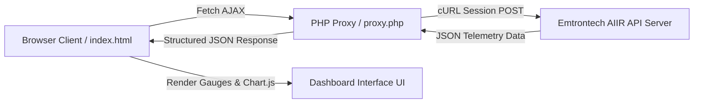

# 🌿 AIIR IAQ Smart Dashboard (ICT BRB)

ระบบติดตามและมอนิเตอร์คุณภาพอากาศภายในอาคาร **ICT BRB (Indoor Air Quality - IAQ)** แบบ Real-time พัฒนาขึ้นเพื่อเชื่อมต่อกับระบบ **Emtrontech AIIR API** โดยแสดงผลข้อมูลเซ็นเซอร์ตรวจวัดคุณภาพอากาศสำหรับห้อง **ICT401 (Site 4)** และภาพรวมเซ็นเซอร์ทุกจุดของอาคารอย่างแม่นยำ

  

---

## 🌟 ฟีเจอร์หลัก (Key Features)

- ⚡ **Real-time Telemetry Monitoring**: ดึงข้อมูลเซ็นเซอร์สดแบบเรียลไทม์จากระบบ AIIR โดยตรงความละเอียดระดับทศนิยม
- 📊 **7 Environmental Metrics (Site 4 ICT401)**:
  - **PM2.5** (µg/m³) — ค่าฝุ่น PM2.5 แบบ Real-time
  - **PM10** (µg/m³) — ค่าฝุ่น PM10 แบบ Real-time
  - **CO2** (ppm) — คาร์บอนไดออกไซด์
  - **อุณหภูมิ (Temperature)** (°C)
  - **ความชื้น (Humidity)** (%RH)
  - **สารระเหยง่าย (EVOC / VOC)** (ppb)
  - **ความแรงสัญญาณ (RSSI Signal)** (dBm)
- 🎨 **Modern Clean Light & Dark Theme**:
  - **Light Mode (Default)**: ดีไซน์โทนสีขาวสะอาดตา เรียบหรู ตาม Design System Palette (Teal `#0D9488`, Azure `#0284C7`, Terracotta `#C36D4B`, Slate `#737877`)
  - **Dark Mode**: สลับธีมมืดได้ด้วยปุ่ม ☀️/🌙 มุมขวาบน พร้อมการปรับสีข้อความในกราฟโดยอัตโนมัติ
- 📈 **Visual Gauge & Historical Trend Chart**:
  - เกจครึ่งวงกลม (Canvas Semi-Circle Gauges) แสดงระดับ PM2.5, CO2 และ อุณหภูมิ
  - กราฟเส้นแนวโน้มย้อนหลัง 10 ครั้งล่าสุด (Interactive Chart.js Trend Line)
- ⚙️ **คำแนะนำการควบคุมระบบอัตโนมัติ (Control Recommendations)**:
  - ประเมินคำแนะนำการเปิด/ปิด เครื่องฟอกอากาศ (Air Purifier), พัดลมระบายอากาศ (Ventilation), เครื่องปรับอากาศ (AC) และเครื่องควบคุมความชื้น อัตโนมัติตามค่าเซ็นเซอร์
- 🔄 **Auto-Refresh & Manual Refresh**: รองรับการดึงข้อมูลใหม่อัตโนมัติทุก 30 วินาที พร้อมไฟแสดงสถานะการเชื่อมต่อ (Connected Badge) และเวลาอัปเดตจากเซ็นเซอร์จริง (`lastUpdate`)
- 📥 **CSV Export**: ดาวน์โหลดตารางข้อมูลเซ็นเซอร์ย้อนหลังเป็นไฟล์ CSV ได้ในคลิกเดียว
- 🔒 **PHP Proxy Security Layer**: `proxy.php` จัดการ Authenticate ผ่าน SHA256, Session Cookie Jar และ Routing API Payload (`site=4&siteType=4`) ป้องกันปัญหา CORS และ Session หมดอายุ

---

## 🎨 โทนสีและระบบดีไซน์ (Design System Palette)

| บทบาทสี (Role) | รหัสสี (Hex Code) | การนำไปใช้งาน (Usage) |
| :--- | :---: | :--- |
| **Primary** | `#0D9488` | ปุ่มหลัก (Primary Button), Active Tab, ค่าสถานะระดับดีเยี่ยม |
| **Secondary** | `#0284C7` | ปุ่ม Refresh, กราฟ CO2, ค่าความชื้น, สถานะปานกลาง |
| **Tertiary** | `#C36D4B` | ปุ่มดาวน์โหลด CSV, ค่าอุณหภูมิ, สถานะเตือน / ค่าสูง |
| **Neutral** | `#737877` | ข้อความอธิบาย, เส้นขอบการ์ด (Borders), RSSI Signal |

---

## 📁 โครงสร้างโปรเจกต์ (Project Structure)

```text
c:\Users\tn_setthanan\Desktop\Copy\
├── index.html        # หน้าจอ Dashboard หลัก (HTML5 Semantic Elements & Responsive Grid)
├── proxy.php         # PHP Proxy Server (cURL API Connector, Session Cookie Jar & Router)
├── css/
│   └── style.css     # CSS Custom Properties, Design System Tokens & Animations
├── js/
│   └── app.js        # Business Logic, Fetch API Integration, Chart.js & Gauge Renderers
└── README.md         # คู่มือและรายละเอียดโครงการ
```

---

## 🚀 ขั้นตอนการติดตั้งและใช้งาน (Installation & Setup)

### 1. ความต้องการของระบบ (Requirements)
- **Web Server**: Apache / Nginx / IIS หรือ XAMPP / Laragon
- **PHP**: เวอร์ชัน 7.4 ขึ้นไป (ต้องเปิดใช้งานโมดูล `php_curl` และ `session`)
- **Web Browser**: Chrome, Firefox, Edge หรือ Safari เวอร์ชันปัจจุบัน

### 2. การติดตั้ง (Installation)
1. Clone Repository เข้าไปยังโฟลเดอร์ Web Root (เช่น `htdocs` หรือ `www`):
   ```bash
   git clone https://github.com/sattxnan007/Ari-ICT-BRB-SERVICE-DESK.git
   ```
2. รันเว็บเซิร์ฟเวอร์ และเปิดผ่านเบราว์เซอร์:
   ```text
   http://localhost/Ari-ICT-BRB-SERVICE-DESK/index.html
   ```

### 3. การเข้าสู่ระบบ (Login)
- กรอก Username และ Password ในแถบ Sidebar ด้านซ้าย (ระบบทดสอบรองรับ Username: `admin`)
- กดปุ่ม **🔑 Login & Connect** เพื่อเริ่มต้นการดึงข้อมูล Real-time จากเซ็นเซอร์

---

## 🛠️ รายละเอียดทางเทคนิค (Technical Architecture)



---

## 📄 ใบอนุญาต (License)

โปรเจกต์นี้จัดทำขึ้นภายใต้ **MIT License** สามารถนำไปพัฒนาและปรับแต่งเพิ่มเติมได้ตามต้องการ

---
*พัฒนาสำหรับระบบติดตามคุณภาพอากาศอาคาร ICT BRB* 🌿
